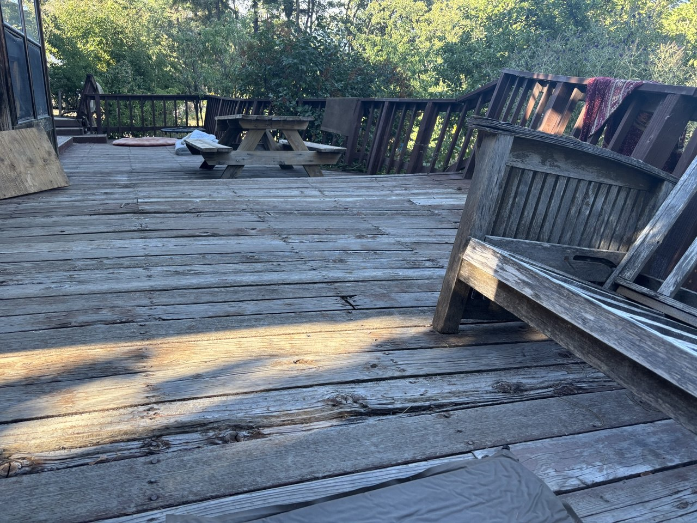

# Pine Tree Deck Fix
**Property:** Pine Tree  
**Project:** Deck Repair  

---

## What needs to be done

The deck at Pine Tree needs some serious work. The joists are rotting, posts are leaning, and the railing is crooked. Here's what needs to be fixed

---

## Work Breakdown

### 1. Replace Outer Joists (for railing support)

#### Materials needed
- Treated 2x8 joists (Four 12 foot, 2 8ft, 2 10ft)
  - 4 × 12ft = 48ft
  - 2 × 8ft = 16ft  
  - 2 × 10ft = 20ft
  - Total: 84 linear feet
  - Board feet: 84ft × 1.33 = 112 board feet
  - Estimated cost: $18 a board for 8 boards
- Structural screws
- **Materials Cost:** $150

#### Work involved
- Remove existing outer joists
- Install new treated joists
- Secure with proper fasteners
- **Labor Cost:** 2 days

**Total:** $150 + 2 days

---

### 2. Replace 6 Inner Joists

#### Materials needed
- Treated 2x8 joists (6 12ft pieces) $18 dollar a board total $108
- Joist hangers - 2 hangers per board (optional but suggested) $45
- **Materials Cost:** $150

#### Work involved
- Remove damaged inner joists
- Install new joists with proper spacing
- Make sure everything is level
- Secure all connections
- **Labor Cost:** 2 days

**Total:** $150 + 2 days

---

### 3. Add Support Beam for Long Span

#### Materials needed
- Treated 2 sistered 2x8 $30
- 3 4x4 posts ~$30
- Beam brackets and hardware (optional but nice to have) ~$80
- Concrete footings 3 bags of concrete or 3 prepoured piers $20
- **Materials Cost:** $160

#### Work involved
- Install support posts (if needed)
- Put in new beam
- Connect to existing structure
- **Labor Cost:** 2 days

**Total:** $160 + 2 days

---

### 4. Fix Support Posts (~10 posts)

#### Materials needed
- Treated 4x4 or 6x6 posts (10 pieces) ~$100
- Post bases and hardware  ~$25
- **Materials Cost:** $125

#### Work involved
- Check current post conditions
- Straighten posts that can be saved
- Replace bad posts
- Make sure everything is straight and solid
- **Labor Cost:** 2 days

**Total:** $125 + 2 days

---

### 5. Fix Railing

#### Materials needed
 4 2x8 to replace rotted supports $50
 Bolts, structural screws, and lag screws $50
- **Materials Cost:** $100

#### Work involved
- Straighten all railing sections
- Tighten loose connections
- Make sure height and spacing is right

- **Labor Cost:** 1 day

**Total:** $100 + 1 day

---

## Summary

| Item | Materials | Labor | Total |
|------|-----------|-------|-------|
| Outer Joist Replacement | $150 | 2 days | $150 + 2 days |
| Inner Joist Replacement | $150 | 2 days | $150 + 2 days |
| Additional Support Beam | $160 | 2 days | $160 + 2 days |
| Support Post Work | $125 | 2 days | $125 + 2 days |
| Railing Straightening | $100 | 1 day | $100 + 1 day |
| **TOTAL** | **$685** | **9 days** | **$685 + 9 days** |

---

# Photos of Current Problems

## What's wrong with the deck

These pictures show the main issues that need fixing:

### 1. Rim Joist Water Damage

**Problem:** The fascia was installed onto the rim joist in a manner that holds water and has caused rot.

**Fix:** Replace all damaged rim joists with treated lumber, reinstall fascia to sit below the deck boards so water is less prove to sit on joist

---

### 2. Split Joists

**Problem:** Several joists are split and broken.

**Fix:** Replace all broken joists.  Add additional support beam to the middle of section to reduce stress on the long span

---

### 3. Joist Alignment and Lean

**Problem:** Joists are crooked and leaning, which means the foundation has issues.

**Fix:** Straighten joists and add support where needed.

---

### 4. Leaning Support Posts

**Problem:** Support posts are leaning, making the whole deck unstable.

**Fix:** Straighten posts that can be saved, replace the bad ones.

---

### 5. General Joist Condition

**Problem:** Overall, the joist system is falling apart.

**Fix:** Replace and reinforce the whole joist structure.

---

### 6. Sagging Deck View

**Problem:** The deck surface is visibly sagging, indicating structural failure in the joist system and support structure.

**Fix:** Replace damaged joists, add additional support beams, and reinforce the overall structure to restore proper deck level and stability.

---

